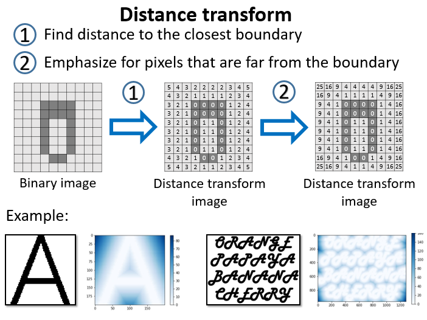
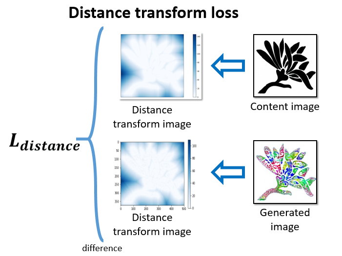
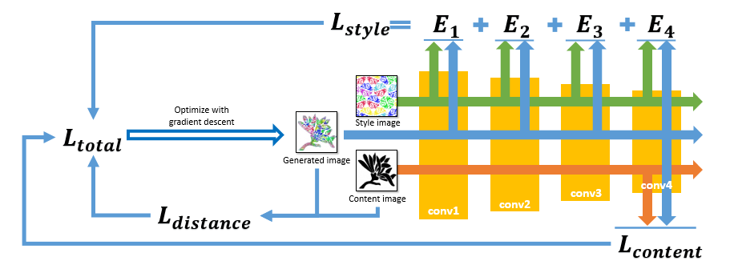
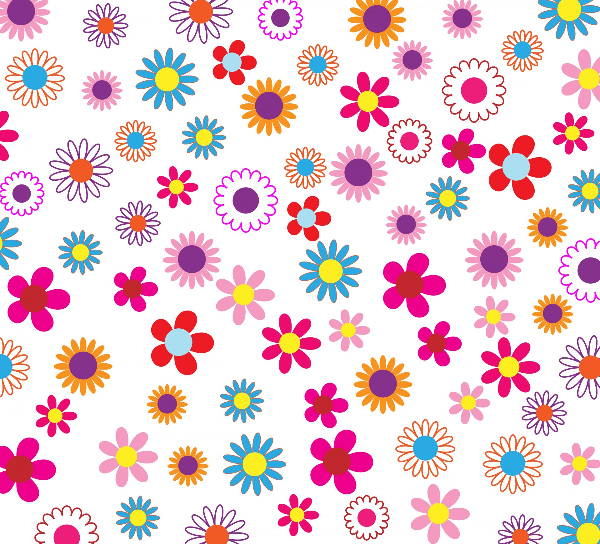

# Constrained Neural Style Transfer for Decorated Logo Generation

This is the repository for the implementation of ["Constrained Neural Style Transfer for Decorated Logo Generation"](https://arxiv.org/pdf/1803.00686.pdf) by G. Atarsaikhan, B. K. Iwana and S. Uchida.

## Table of Contents

1. [Introduction](#introduction)
2. [Results](#results)
3. [Requirements](#requirements)
4. [Running the code](#running-the-code)

## Introduction

We propose "Distance transform loss" to be added upon the existing loss functions of neural style transfer. The "Distance transform loss" is the difference between distance transform images of the content image and generated image.

|   |  |
| ------------- | ------------- |
|    |   |

We added the "Distance transform loss" onto the neural style transfer network.



## Results


| Content image   | Style image  | Generated image |
| :-------------: | :-------------: | :-------------: |
|    |    | 

|  |  |  |
| :-------------: | :-------------: | :-------------: |
|    |    | 

|  |  |  |
| :-------------: | :-------------: | :-------------: |
|    |    | 


## Requirements

* Python >= 3.5

* TensorFlow >= 1.8

* Numpy & Scipy

* OpenCV >= 3.x (cv2)

* Matplotlib

* Download the pre-trained weights for VGG network from [here](https://drive.google.com/open?id=1iF4oKdb-5-45AAmGIwaJyMNcjI9xJZ2i), and place it on the main folder. (~500MB)

## Running the code

### Style transfer
```
python StyleTransfer.py -CONTENT_IMAGE <path_to_content_image> -STYLE_IMAGE <path_to_style_image> 
```
### Other parser arguments:
```
alpha = 0.001 # Override with -alpha
beta  = 0.8   # Override with -beta
gamma = 1e-11 # Override with -gamma
IMAGE_WIDTH = 400 # Override with -width
w1~w5 = 1 # Override with -w1 ~ -w5
```

